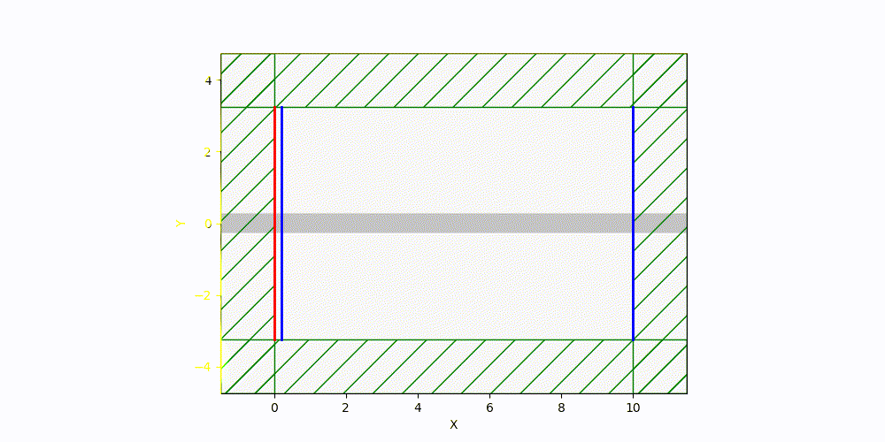

# **Photonic-Waveguide-Simulation**
**Meep** 와 **Gdsfactory** 파이썬 모듈을 이용하여 도파로 구현 및 시뮬레이션 

# **Straight Waveguide Analysis**
이 프로젝트는 직선 도파로에서 기본적인 빛의 전파를 시연하는 프로젝트 입니다.

# **Key Features**
**Standard Physical Design**: **현실성**을 위해 실제 반도체 공정 값을 반영하여 시뮬레이션의 정확도를 높였습니다.(표준 PDK 사용)

**Electromagnetic Field Analysis** : 맥스웰 법칙중 패러데이 법칙, 앙페르-맥스웰 법칙에 의거하여 **Ez** 성분을 분석하여 빛의 파동을 시각화 하였습니다. 

**Stable Simulation Flow** : 빛이 도파로를 완전히 통과를 할때까지 시뮬레이션을 진행하여 데이터의 정확도, 신뢰성을 확보 하였습니다.(until = 200으로 충분한 시간 확보)

# **Simulation Result**

# **Requirements**
- `Meep`
- `gdsfactory`
- `gplugins`
